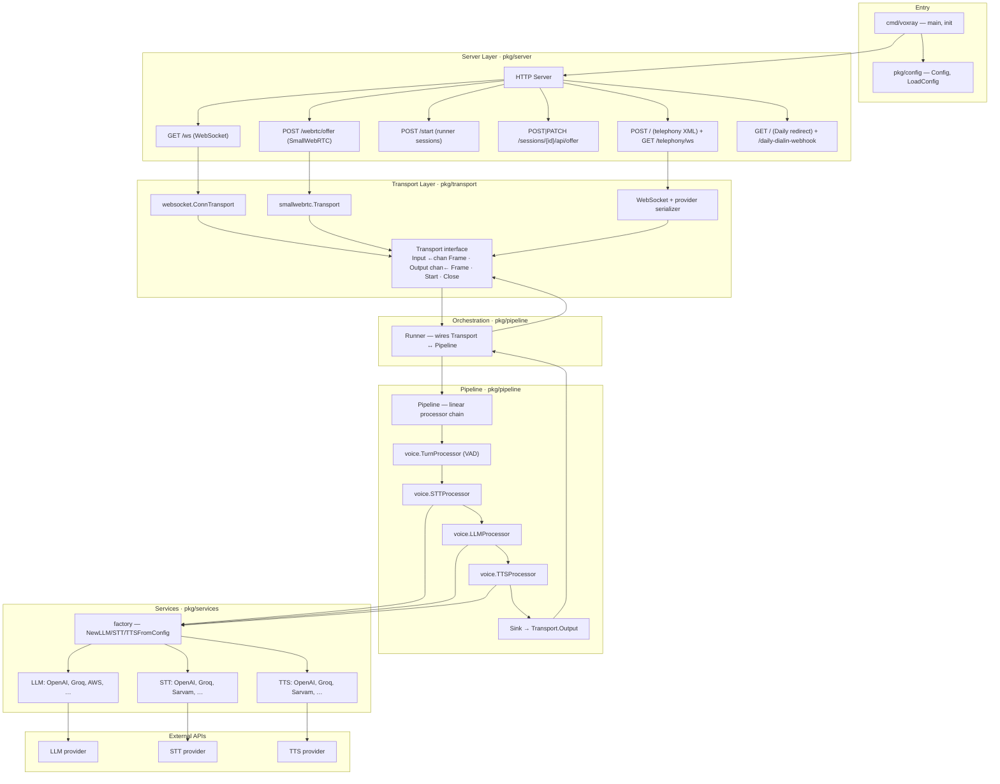

Voxray is a config-driven Go server for real-time AI voice agents. A single process handles any number of concurrent connections. Each connection gets its own Transport, Runner, and Pipeline — fully isolated, no shared mutable state between sessions.

## Layer Overview

Every request travels through the same vertical stack. The diagram below shows the full path from the CLI entry point down to the external AI provider APIs.



## Component Descriptions

### HTTP Server — `pkg/server`

The server layer registers all HTTP routes and handles cross-cutting concerns: authentication, CORS headers, and Prometheus metrics scraping. For each new inbound connection it constructs a Transport and fires the `onTransport` callback, which builds the Pipeline and starts a Runner goroutine. Route sets vary by runner mode: WebSocket sessions use `/ws`; SmallWebRTC uses `/webrtc/offer`; runner-style deployments add `/start` and `/sessions/{id}/api/offer` backed by a `SessionStore`; telephony providers hit `POST /` for the XML webhook and establish a media stream on `/telephony/ws`; Daily.co deployments serve `GET /` as a room redirect.

### Transport — `pkg/transport`

The `Transport` interface is the only abstraction between the network and the pipeline. It exposes two frame channels (`Input() <-chan Frame` and `Output() chan<- Frame`) plus `Start(ctx)` and `Close()`. All network details — framing, serialization, reconnection — are encapsulated here. Three production implementations:

- **`websocket.ConnTransport`** — JSON envelope or binary Protobuf over a WebSocket connection; optional write coalescing (`ws_write_coalesce_ms`) to batch small frames and reduce syscalls
- **`smallwebrtc.Transport`** — WebRTC data-channel and media-track bridge; one goroutine per inbound track, one for outbound
- **Telephony WebSocket** — provider-specific serializers for Twilio, Telnyx, Plivo, and Exotel; the same `Transport` interface is exposed to the Runner so no pipeline changes are required when switching providers

A `memory.Transport` is provided for tests and in-process pipelines.

### Runner — `pkg/pipeline`

The Runner owns the goroutine lifecycle for a single session. It spawns two goroutines: a **reader** that reads frames off `Transport.Input` and enqueues them into a bounded channel (capacity configurable via `pipeline_input_queue_cap`, default 256), and a **worker** that drains that queue and calls `Pipeline.Push`. Back-pressure is explicit: when the queue is full, the reader blocks rather than allocating unbounded memory. Both goroutines honour `context` cancellation so shutdown drains cleanly.

### Pipeline — `pkg/pipeline`

The Pipeline holds a linear slice of `Processor` values linked as a doubly-connected chain (each processor knows its `next` and `prev`). `Pipeline.Push(ctx, frame)` calls `ProcessFrame` on the first processor with direction `Downstream`; each processor either transforms the frame and calls `PushDownstream`, or drops it. `Pipeline.Setup` and `Pipeline.Cleanup` call the corresponding lifecycle hooks on every processor in order (cleanup runs in reverse).

### Processors — `pkg/processors`

Processors are the fundamental unit of work. The `Processor` interface is implemented by everything that touches a frame: VAD and turn detection (`voice.TurnProcessor`), speech-to-text (`voice.STTProcessor`), language model inference (`voice.LLMProcessor`), text-to-speech synthesis (`voice.TTSProcessor`), the `Sink`, and a growing library of utility processors — echo, logger, aggregators, filters, and framework bridges (RTVI, external HTTP chain).

### Services — `pkg/services`

Services provide the provider-agnostic interfaces that processors call:

- `LLMService` — `Chat(ctx, messages, onToken)` streaming interface
- `STTService` — `Transcribe(ctx, audio, sampleRate, channels)` returning `[]TranscriptionFrame`
- `TTSService` — `Speak(ctx, text, sampleRate)` returning `[]TTSAudioRawFrame`

The `factory` package resolves the correct implementation from config. Over 40 provider implementations ship under `pkg/services/`.

## Data Flow Sequence

```mermaid
sequenceDiagram
    participant Client
    participant Transport
    participant Runner
    participant Turn as TurnProcessor
    participant STT as STTProcessor
    participant LLM as LLMProcessor
    participant TTS as TTSProcessor
    participant Sink

    Client->>Transport: connect (WS / WebRTC / telephony WS)
    Transport->>Runner: Start(ctx)
    Runner->>Runner: Setup(ctx) + Push(StartFrame)

    loop Per audio chunk
        Client->>Transport: bytes
        Transport->>Runner: AudioRawFrame (via Input channel)
        Runner->>Turn: ProcessFrame(AudioRawFrame)
        Note over Turn: VAD + silence detection; buffers chunks
        Turn->>STT: ProcessFrame(AudioRawFrame) — on turn complete
        Note over STT: Buffers ≥500ms audio; calls STTService.Transcribe
        STT->>LLM: ProcessFrame(TranscriptionFrame)
        Note over LLM: Appends user message; calls LLMService.Chat (streaming)
        LLM->>TTS: ProcessFrame(LLMTextFrame) — per token
        Note over TTS: Batches tokens by sentence; calls TTSService.Speak
        TTS->>Sink: ProcessFrame(TTSAudioRawFrame)
        Sink->>Transport: Output() <- TTSAudioRawFrame
        Transport->>Client: bytes
    end
```

<Note>
  `UserStartedSpeakingFrame` and `UserStoppedSpeakingFrame` are emitted by `TurnProcessor` and flow downstream alongside the audio. `TTS` watches for `UserStartedSpeakingFrame` as a barge-in signal and immediately clears its text buffer.
</Note>

## Frame Types

Every object that flows through a pipeline is a `Frame`. The table below covers the most important frame types; see `pkg/frames` for the full set.

| Frame Type | Direction | Description |
| --- | --- | --- |
| `AudioRawFrame` | Downstream | Raw 16-bit PCM audio from the client; carries `SampleRate` and `Channels` |
| `TTSAudioRawFrame` | Downstream | Synthesised PCM audio from a TTS provider; routed to the Sink |
| `TranscriptionFrame` | Downstream | Text transcript produced by `STTProcessor`; carries `Text`, `Finalized`, `Language` |
| `LLMTextFrame` | Downstream | A single streamed token from `LLMProcessor`; accumulated by `TTSProcessor` into utterances |
| `LLMContextFrame` | Downstream | Full conversation context injected by aggregators or the RTVI processor |
| `StartFrame` | Downstream | Signals pipeline startup |
| `CancelFrame` | Downstream | Signals immediate cancellation |
| `EndFrame` | Downstream | Signals graceful end-of-stream |
| `ErrorFrame` | Upstream | Non-fatal error from any processor; propagates upstream for logging |
| `InterruptionFrame` | Downstream | Barge-in signal; instructs downstream processors to abort in-progress synthesis |
| `UserStartedSpeakingFrame` | Downstream | Emitted by `TurnProcessor` when VAD transitions to speech |
| `UserStoppedSpeakingFrame` | Downstream | Emitted by `TurnProcessor` after configured silence threshold |
| `BotStartedSpeakingFrame` | Downstream | Emitted by `TTSProcessor` before the first audio frame of a bot response |
| `BotStoppedSpeakingFrame` | Downstream | Emitted by `TTSProcessor` after the last audio frame |
| `VADParamsUpdateFrame` | Upstream | Runtime update to VAD stop/start thresholds; handled by `TurnProcessor` |

## Runner Modes

The runner mode determines which HTTP routes are registered and which Transport implementations are instantiated. Set `transport` (for WebSocket/WebRTC) and `runner_transport` (for telephony/Daily) in `config.json`.

| Mode | Config value | Entry points | Transport source |
| --- | --- | --- | --- |
| WebSocket only | `transport: "websocket"` (or `""`) | `GET /ws` | `pkg/transport/websocket` |
| WebRTC only | `transport: "smallwebrtc"` | `POST /webrtc/offer` | `pkg/transport/smallwebrtc` |
| Both | `transport: "both"` | `/ws` and `POST /webrtc/offer` | Both of the above |
| Runner (session-based) | `transport: "both"` or WebRTC | `POST /start`, `POST|PATCH /sessions/{id}/api/offer` | SessionStore \+ SmallWebRTC |
| Daily | `runner_transport: "daily"` | `GET /` → room redirect; `POST /daily-dialin-webhook` | Daily.co room client via /sessions |
| Telephony | `runner_transport: "twilio"|"telnyx"|"plivo"|"exotel"` | `POST /` (XML webhook), `GET /telephony/ws` | WebSocket with provider serializer |

<Warning>
  When scaling horizontally across multiple instances, set `session_store: "redis"` and `redis_url` in config. Without Redis, session IDs created on one instance are invisible to others and runner-mode connections will fail.
</Warning>

## Key Packages Reference

| Package path | Responsibility |
| --- | --- |
| `cmd/voxray` | Entry point: parse flags, load config, register plugins, start server |
| `pkg/config` | `Config` struct, `LoadConfig`, `GetAPIKey` (with env resolution and caching) |
| `pkg/server` | HTTP server, route registration, `onTransport` callback, Prometheus metrics |
| `pkg/transport` | `Transport` interface; `websocket`, `smallwebrtc`, `memory` sub-packages |
| `pkg/pipeline` | `Pipeline`, `Runner`, `Source`, `Sink`, `Registry` |
| `pkg/processors` | `Processor` interface, `BaseProcessor`, direction constants |
| `pkg/processors/voice` | `TurnProcessor`, `STTProcessor`, `LLMProcessor`, `TTSProcessor` |
| `pkg/processors/aggregators` | `dtmf_aggregator`, `gated`, `llmfullresponse`, `llmtext`, `userresponse`, `llmcontextsummarizer` |
| `pkg/processors/frameworks` | `external_chain` (HTTP sidecar), `rtvi` (RTVI protocol) |
| `pkg/services` | `LLMService`, `STTService`, `TTSService` interfaces; `factory`; 40\+ provider implementations |
| `pkg/realtime` | `RealtimeSession`, `RealtimeService` — OpenAI Realtime API integration |
| `pkg/runner` | `SessionStore` (memory / Redis); Daily room/token helpers; telephony serializers |
| `pkg/frames` | All frame types; `serialize` sub-package (JSON envelope, binary Protobuf) |
| `pkg/audio` | VAD, turn analyzer, resampler, WAV encoder |
| `pkg/observers` | `ObservingProcessor`, Prometheus metrics, turn tracking, user–bot latency |
| `pkg/mcp` | MCP stdio client; tool schema conversion; LLM tool registration |
| `pkg/plugin` | `Plugin` interface and `Registry` for config-driven pipeline assembly |
| `pkg/utils` | `ExponentialBackoff`, miscellaneous utilities |
| `pkg/extensions` | Voicemail and IVR extensions |