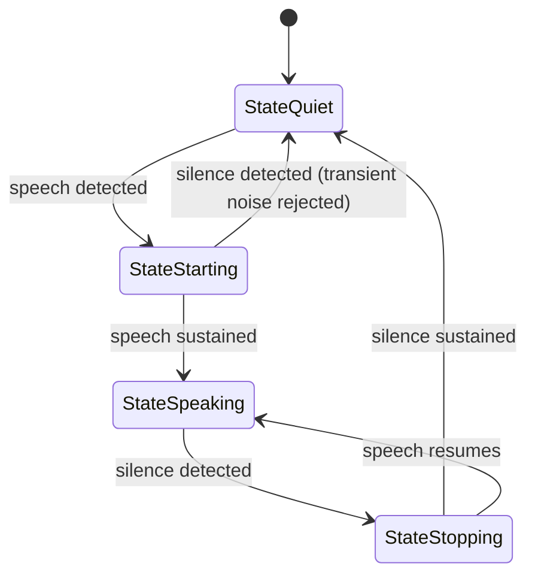

## Audio Format Standards

All internal audio in Voxray uses **PCM 16-bit little-endian mono**.

| Pipeline Stage | Sample Rate | Format |
| --- | --- | --- |
| STT input (`AudioRawFrame`) | 16,000 Hz | PCM 16-bit LE mono |
| TTS output (`TTSAudioRawFrame`) | 24,000 Hz | PCM 16-bit LE mono |
| WebRTC inbound (raw RTP) | 48,000 Hz | Opus (decoded at boundary) |
| WebRTC outbound (raw RTP) | 48,000 Hz | PCM → Opus at boundary |
| Telephony inbound | 8,000 Hz | G.711 μ-law (decoded at boundary) |
| Telephony outbound | 8,000 Hz | G.711 μ-law (encoded at boundary) |

## Resampling

`pkg/audio/resample.go` provides linear interpolation resampling for 16-bit mono PCM.

| Conversion | Ratio | Where used |
| --- | --- | --- |
| 48,000 → 16,000 Hz | 3:1 downsample | WebRTC inbound |
| 24,000 → 48,000 Hz | 2:1 upsample | WebRTC outbound |
| 8,000 → 16,000 Hz | 2:1 upsample | Telephony inbound |
| 24,000 → 8,000 Hz | 3:1 downsample | Telephony outbound |

## Voice Activity Detection (VAD)

### VAD State Machine



### VAD Configuration

| Config Key | Description | Default |
| --- | --- | --- |
| `vad_type` | `"energy"` or `"silero"` | `"energy"` |
| `vad_confidence` | Minimum voice confidence `[0..1]` | `0.7` |
| `vad_start_secs_vad` | Duration of sustained speech to enter `StateSpeaking` | `0.2` |
| `vad_stop_secs` | Duration of silence to exit `StateSpeaking` | `0.2` |
| `vad_min_volume` | Minimum RMS volume `[0..1]` | `0.2` |
| `vad_threshold` | Raw RMS energy threshold | `0.02` |

## Turn Detection

### Silence-Based (default)

```json
{"turn_detection": "silence"}
```

After `turn_stop_secs` of continuous silence following speech, the pipeline emits end-of-turn and sends audio to STT.

### Disabled

```json
{"turn_detection": "none"}
```

Use when an external system (e.g., push-to-talk button) controls turn boundaries.

### Turn Detection Configuration

| Config Key | Description | Default |
| --- | --- | --- |
| `turn_stop_secs` | Seconds of silence after speech to trigger end-of-turn | `3.0` |
| `turn_pre_speech_ms` | Audio buffered before VAD detects speech | `500` |
| `turn_max_duration_secs` | Maximum duration of a single turn | `8.0` |
| `user_idle_timeout_secs` | Seconds after bot finishes before emitting `UserIdleFrame` | varies |

### Turn Detection Tuning Guide

| Scenario | Recommendation |
| --- | --- |
| Call center (noisy) | Raise `vad_min_volume` to `0.3`, `turn_stop_secs` to `4.0` |
| Fast-paced conversation | Lower `turn_stop_secs` to `1.5`–2.0 |
| Non-native speakers | Raise `turn_stop_secs` to `4.0`–5.0 |
| Push-to-talk | Set `turn_detection: "none"`, send `EndFrame` on button release |