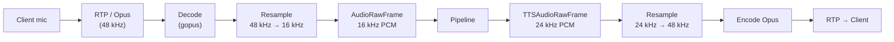

Every pipeline session in Voxray starts with a **Transport**: the boundary between a network connection and the frame-processing pipeline.

## The Transport Interface

```go
type Transport interface {
    Input()  <-chan frames.Frame
    Output() chan<- frames.Frame
    Start(ctx context.Context) error
    Close() error
}
```

## WebSocket Transport

`ConnTransport` wraps a single WebSocket connection with a single `readLoop` and `writeLoop` goroutine.

### Wire Formats

<Tabs>
  <Tab title="JSON (default)">
    ```text
    ws://your-server/ws
    ```

    All messages are WebSocket text frames carrying a JSON envelope:

    ```json
    {"type": "audio_raw", "data": {"audio": "<base64>", "sample_rate": 16000}}
    ```
  </Tab>
  <Tab title="Protobuf">
    ```text
    wss://your-server/ws?format=protobuf
    ```

    Binary WebSocket frames. Lower bandwidth and parse overhead.
  </Tab>
  <Tab title="RTVI">
    ```text
    wss://your-server/ws?rtvi=1
    ```

    [Pipecat RTVI protocol](https://github.com/pipecat-ai/rtvi) with handshake and RTVI-typed envelopes.
  </Tab>
</Tabs>

### Write Coalescing

```json
{
  "ws_write_coalesce_ms": 5,
  "ws_write_coalesce_max_frames": 20
}
```

## WebRTC Transport (SmallWebRTC)

WebRTC sessions use a standard SDP offer/answer handshake:

```http
POST /webrtc/offer
Content-Type: application/json

{"offer": "<SDP offer string>"}
```

Response:

```json
{"data": {"answer": "<SDP answer string>"}}
```

### Audio Flow



### ICE / STUN / TURN Configuration

```json
{
  "webrtc_ice_servers": [
    {"urls": ["stun:stun.l.google.com:19302"]},
    {"urls": ["turn:your-turn-server:3478"], "username": "user", "credential": "pass"}
  ]
}
```

## Telephony Adapters

| Provider | Config Value | Serializer | Notes |
| --- | --- | --- | --- |
| Twilio | `runner_transport: "twilio"` | `TwilioSerializer` | μ-law (PCMU), 8 kHz |
| Telnyx | `runner_transport: "telnyx"` | `TelnyxSerializer` | μ-law (PCMU), 8 kHz |
| Plivo | `runner_transport: "plivo"` | `PlivoSerializer` | μ-law (PCMU), 8 kHz |
| Exotel | `runner_transport: "exotel"` | `ExotelSerializer` | μ-law (PCMU), 8 kHz |

## Runner Session Mode

For horizontal scaling:

```http
POST /start
→ {"sessionId": "abc123"}

POST /sessions/abc123/api/offer
Content-Type: application/json
{"offer": "<sdp>"}
→ {"data": {"answer": "<sdp>"}}
```

<Tip>
  Configure Redis as the session store (`session_store: "redis"`) so any Voxray instance can handle the offer.
</Tip>