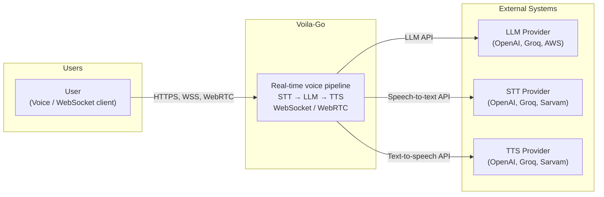
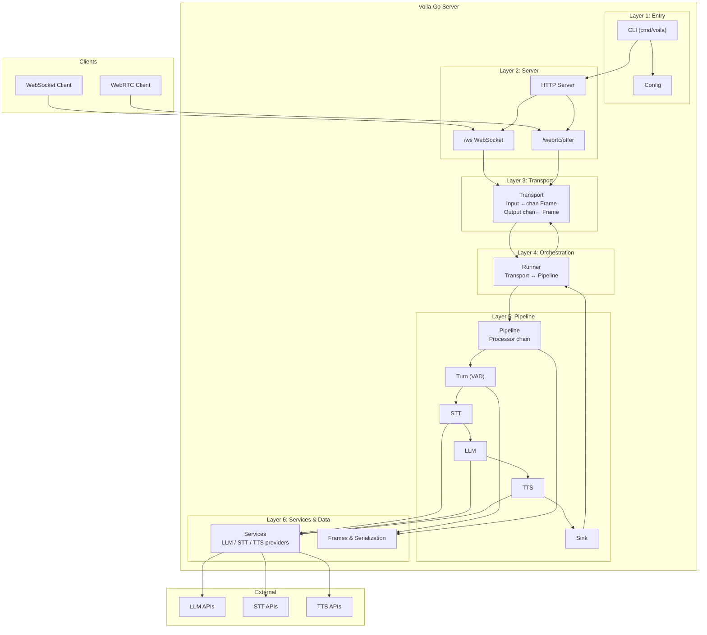
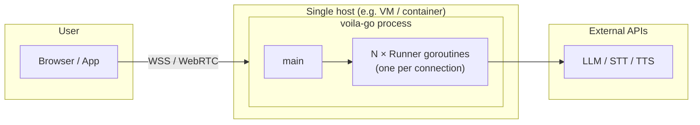

# Voila-Go System Architecture

System-level view of the **voila-go** real-time voice pipeline. For component details, data flow, and file layout see [ARCHITECTURE.md](./ARCHITECTURE.md).

---

## 1. System Context (C4 Level 1)



**In words:** Users connect to Voila-Go via WebSocket or WebRTC. Voila-Go runs a configurable pipeline (e.g. voice: VAD → STT → LLM → TTS) and talks to external LLM, STT, and TTS providers. Frames (audio, text, transcriptions) flow bidirectionally between client and server.

---

## 2. Layered System Architecture



| Layer | Responsibility |
|-------|----------------|
| **1 Entry** | Load config, register processors, start server; on new transport → build pipeline + runner |
| **2 Server** | HTTP server; WebSocket and SmallWebRTC endpoints; `onTransport` callback |
| **3 Transport** | Bidirectional frame streams (Input/Output), Start/Close; WebSocket & WebRTC impls |
| **4 Orchestration** | Runner wires Transport ↔ Pipeline; forwards input → Push, pipeline output → transport |
| **5 Pipeline** | Linear processor chain (Turn → STT → LLM → TTS → Sink or plugins → Sink) |
| **6 Services & Data** | LLM/STT/TTS providers; Frame types and JSON/protobuf serialization |

---

## 3. Runtime: One Connection

```mermaid
sequenceDiagram
    autonumber
    participant Client
    participant Server
    participant Transport
    participant Runner
    participant Pipeline
    participant Processors

    Client->>Server: Connect (WS or WebRTC)
    Server->>Transport: New transport
    Server->>Runner: Run(transport) [goroutine]
    Runner->>Pipeline: Setup(ctx), Push(StartFrame)

    loop Frames
        Client->>Transport: bytes
        Transport->>Runner: Frame (Input)
        Runner->>Pipeline: Push(Frame)
        Pipeline->>Processors: Turn → STT → LLM → TTS → Sink
        Processors->>Pipeline: output frames
        Pipeline->>Runner: frames to Sink
        Runner->>Transport: Output() ← Frame
        Transport->>Client: bytes
    end

    Note over Client,Processors: One goroutine per connection; pipeline is linear.
```

---

## 4. Deployment View



- **Single process:** One `voila-go` process; one goroutine per active connection (Runner).
- **No built-in clustering:** Horizontal scaling = multiple instances behind a load balancer; no shared state between instances.
- **Config:** `config.json` (and env) drives providers and pipeline shape.

---

## 5. Key Design Decisions

| Decision | Rationale |
|----------|-----------|
| **Transport interface** | Same pipeline runs over WebSocket or WebRTC; easy to add more transports. |
| **Linear processor chain** | Simple Push(frame) flow; each processor does one job (Turn, STT, LLM, TTS, Sink). |
| **Runner per connection** | Isolates sessions; one connection failure does not block others. |
| **Frames + serialization** | Unified Frame type (audio, text, transcription, etc.); JSON or binary protobuf for pipecat compatibility. |
| **Config-driven pipeline** | Voice pipeline (provider + model) or plugin chain (echo, logger, etc.) from config. |

---

## 6. References

- **Full architecture:** [ARCHITECTURE.md](./ARCHITECTURE.md) — components, Mermaid diagrams, data flow, file layout.
- **Extensions:** [EXTENSIONS.md](./EXTENSIONS.md) — adding processors and transports.
- **API:** [swagger.yaml](./swagger.yaml) / [swagger.json](./swagger.json).
