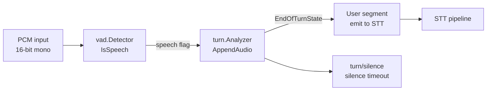

# Audio

Package `audio` provides audio types, VAD (voice activity detection), turn detection (silence-based), codecs (µ-law, A-law), resampling, mixing, WAV, and DTMF WAV generation. Used by the voice pipeline and transport (e.g. WebRTC PCM/Opus).

## Purpose

- **Types**: `Frame` (PCM chunk with sample rate, channels, timestamp), `Stream` (Read/Write/Close).
- **VAD**: `vad.Detector` (IsSpeech); `EnergyAnalyzerBackend` (RMS threshold); optional Silero backend.
- **Turn**: `turn.Analyzer` (AppendAudio, AnalyzeEndOfTurn, AnalyzeEndOfTurnAsync); silence-based implementation; user strategies and controller for when to emit user-turn segments.
- **Codecs**: µ-law, A-law encode/decode for telephony.
- **Resample**: Sample rate conversion for STT/TTS (e.g. 48k → 16k).
- **Mix**: Mix multiple PCM streams (e.g. user + bot for recording).
- **WAV**: Read/write 16-bit PCM WAV.
- **DTMF**: Generate DTMF tone WAV files.

## Audio pipeline (VAD and turn)

- Incoming audio is passed to VAD; the pipeline (e.g. voice processor) appends audio to the turn analyzer. When the analyzer reports Complete (e.g. silence after speech), the buffered segment is sent to STT.

## Exported symbols (root)

| Symbol | Type | Description |
|--------|------|-------------|
| `Frame` | struct | Data, SampleRate, NumChannels, Timestamp |
| `Stream` | interface | Read, Write, Close |
| `PCM16MonoNumFrames(bytes)` | func | len(bytes)/2 |
| `DefaultInSampleRate`, `DefaultOutSampleRate` | const | 16000, 24000 |
| `Resample*` | funcs | Sample rate conversion (see resample.go) |
| `Mix*` | funcs | Mix PCM buffers (see mix.go) |
| `EncodeULaw`, `DecodeULaw`, `EncodeALaw`, `DecodeALaw` | funcs | µ-law/A-law codecs |
| WAV, DTMF helpers | funcs | See wav.go, dtmf_wav.go |

## Subpackages

| Path | Description |
|------|-------------|
| `vad` | Detector, EnergyAnalyzerBackend; IsSpeech, SetSampleRate; optional Silero |
| `turn` | Analyzer interface; Params, EndOfTurnState, EndOfTurnResult; silence impl; user_controller, user_strategies |
| `filters` | Audio filters (see filters.go) |
| `mixers` | Mixer utilities (see mixers.go) |
| `interruptions` | Interruption/barge-in handling |

## Concurrency

- **Frame/Stream**: No internal state; safe for concurrent use where documented.
- **vad.Detector**: Implementations may or may not be safe for concurrent use; typically one detector per pipeline.
- **turn.Analyzer**: AppendAudio is called from one goroutine; AnalyzeEndOfTurn(Async) may be called from another; implementations use mutexes where needed.

## Files (root)

| File | Description |
|------|-------------|
| `audio.go` | PCM16MonoNumFrames, DefaultInSampleRate, DefaultOutSampleRate |
| `types.go` | Frame, Stream |
| `resample.go` | Resample helpers |
| `mix.go` | Mix helpers |
| `alaw.go`, `ulaw.go` | A-law, µ-law codecs |
| `wav.go` | WAV read/write |
| `dtmf_wav.go` | DTMF tone WAV generation |

## See also

- [../processors/README.md](../processors/README.md) — Voice pipeline uses VAD and turn
- [../recording/README.md](../recording/README.md) — Recording uses mix for combined WAV
- [../transport/smallwebrtc/](../transport/README.md) — WebRTC uses resample and codecs
- [../config/README.md](../config/README.md) — VAD and turn config (TurnDetection, TurnStopSecs, VADType, etc.)
