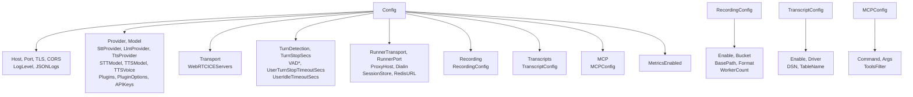

# Config

Package `config` handles application configuration: JSON file loading and environment variable overrides (12-factor style).

## Purpose

- **Config**: Single struct for server (host, port, TLS, CORS), transport (WebSocket/WebRTC), pipeline (provider, model, STT/LLM/TTS overrides), turn/VAD, runner, recording, transcripts, MCP, metrics, logging.
- **LoadConfig**: Reads JSON from path and applies `ApplyEnvOverrides` so env vars override file values.
- **Nested configs**: `RecordingConfig`, `TranscriptConfig`, `MCPConfig` for recording, transcripts, and MCP tool integration.

## Config struct tree

## Exported symbols

| Symbol | Type | Description |
|--------|------|-------------|
| `Config` | struct | Root config; fields for server, pipeline, transport, turn/VAD, runner, recording, transcripts, MCP, metrics |
| `RecordingConfig` | struct | Enable, Bucket, BasePath, Format, WorkerCount |
| `TranscriptConfig` | struct | Enable, Driver, DSN, TableName |
| `MCPConfig` | struct | Command, Args, ToolsFilter |
| `LoadConfig(path)` | func | Read JSON file and apply env overrides; returns *Config |
| `ApplyEnvOverrides(cfg)` | func | Apply VOXRAY_* and common env vars to cfg |
| `GetEnv(key, def)` | func | os.Getenv with default |
| `(c *Config) GetAPIKey(service, envVar)` | method | API key from APIKeys map or env |
| `(c *Config) STTProvider()`, `LLMProvider()`, `TTSProvider()` | method | Per-task provider (stt_provider/llm_provider/tts_provider or provider) |
| `(c *Config) TurnEnabled()` | method | true when turn_detection == "silence" |
| `(c *Config) VADBackendOrDefault()` | method | VAD type, default "energy" |
| `(c *Config) VADParams()` | method | Struct with Confidence, StartSecs, StopSecs, MinVolume |
| `(c *Config) MetricsEnabledOrDefault()` | method | true if metrics_enabled unset or true |

## Validation

- No built-in validation; callers validate as needed. Unknown JSON keys are ignored.

## Concurrency

- Config is intended to be loaded once and read-only thereafter; no internal locking.

## Files

| File | Description |
|------|-------------|
| `config.go` | Config, RecordingConfig, TranscriptConfig, MCPConfig, LoadConfig, ApplyEnvOverrides, GetEnv, Config methods |

## See also

- [../services/README.md](../services/README.md) — Uses config for provider and API keys
- [../recording/README.md](../recording/README.md) — RecordingConfig
- [../metrics/README.md](../metrics/README.md) — MetricsEnabledOrDefault
- [../../docs/DEPLOYMENT.md](../../docs/DEPLOYMENT.md) — Env vars and deployment
