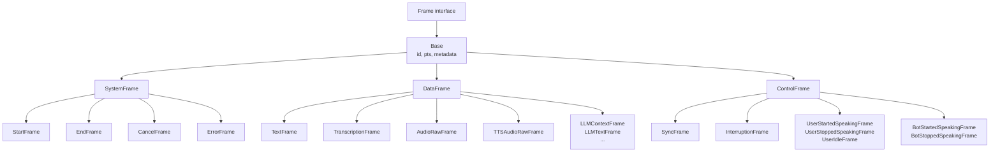
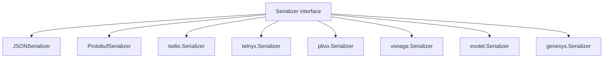

# Frames

Package `frames` defines frame types for the Voxray pipeline: audio, text, system, control, and vendor-specific (RTVI, DTMF). The `serialize` subpackage provides wire serialization (JSON, protobuf, Twilio, Telnyx, etc.).

## Purpose

- **Frame**: Interface implemented by all frames; `FrameType()`, `ID()`, `PTS()`, `Metadata()`.
- **Base**: Common id, pts, metadata; embed in concrete frames. IDs are unique (atomic counter).
- **Concrete frames**: System (Start, End, Cancel, Error, Stop), control (Sync, Interruption, user/bot turn), data (Text, Transcription, AudioRaw, TTSAudioRaw, LLM*, TransportMessage, DTMF, etc.).
- **Serialization**: `serialize.Serializer` (Serialize/Deserialize); JSON envelope, protobuf, and vendor formats (Twilio, Telnyx, Plivo, Vonage, Exotel, Genesys).

## Frame type hierarchy

## Serializers

## Exported symbols (root package)

| Symbol | Type | Description |
|--------|------|-------------|
| `Frame` | interface | FrameType, ID, PTS, Metadata |
| `Base` | struct | NewBase, NewBaseWithID, ID, SetPTS, Metadata |
| `SystemFrame`, `DataFrame`, `ControlFrame` | struct | Base embeddings |
| `StartFrame`, `NewStartFrame` | struct/func | Pipeline init; audio rates, flags |
| `EndFrame`, `NewEndFrame` | struct/func | Normal end |
| `CancelFrame`, `NewCancelFrame` | struct/func | Stop with reason |
| `ErrorFrame`, `NewErrorFrame` | struct/func | Error, Fatal, Processor |
| `TextFrame`, `NewTextFrame` | struct/func | Text, SkipTTS, AppendToContext |
| `TranscriptionFrame`, `NewTranscriptionFrame` | struct/func | STT output; UserID, Timestamp, Finalized |
| `AudioRawFrame`, `NewAudioRawFrame` | struct/func | PCM audio; SampleRate, NumChannels |
| `TTSAudioRawFrame`, `NewTTSAudioRawFrame` | struct/func | TTS output |
| `LLMContext`, `LLMContextFrame`, `LLMRunFrame`, `LLMTextFrame`, etc. | struct/func | LLM context, run, messages, tools, text |
| `UserStartedSpeakingFrame`, `UserStoppedSpeakingFrame`, `UserIdleFrame` | struct/func | User turn control |
| `BotStartedSpeakingFrame`, `BotStoppedSpeakingFrame` | struct/func | Bot turn control |
| `InputDTMFFrame`, `OutputDTMFUrgentFrame` | struct/func | DTMF I/O |
| `RTVIClientMessageFrame`, `RTVIServerMessageFrame` | struct | RTVI protocol |
| `InterruptionFrame`, `NewInterruptionFrame` | struct/func | Barge-in clear |
| Service switcher, transport message, etc. | struct/func | See frames.go, llm.go |

## Subpackage serialize

| Symbol | Description |
|--------|-------------|
| `Serializer` | Serialize(Frame) ([]byte, error), Deserialize([]byte) (Frame, error) |
| `SerializerWithSetup` | Optional Setup(StartFrame) |
| `SerializerWithMessageType` | Optional SerializeWithType → (data, binary) |
| `JSONSerializer`, `ProtobufSerializer` | Built-in |
| `twilio`, `telnyx`, `plivo`, `vonage`, `exotel`, `genesys` | Vendor Serializer + Params |

## Concurrency

- Frame ID generation uses `atomic.AddUint64`; safe for concurrent frame creation.
- Frames are intended to be immutable after creation (except metadata); no internal locking.

## Files (root)

| File | Description |
|------|-------------|
| `frames.go` | Frame, Base, system/data/control frames, audio, text, transcription, error, service switcher |
| `llm.go` | LLMContext, LLM* frames, TTSSpeakFrame, FunctionCallResultFrame |
| `user_turn.go` | UserStartedSpeaking, UserStoppedSpeaking, UserIdle |
| `bot_turn.go` | BotStartedSpeaking, BotStoppedSpeaking |
| `vad.go` | VADParamsUpdate, VADUserStarted/StoppedSpeaking, UserSpeakingFrame |
| `dtmf.go` | InputDTMFFrame, OutputDTMFUrgentFrame |
| `rtvi.go` | RTVIClientMessageFrame, RTVIServerMessageFrame |

## See also

- [../pipeline/README.md](../pipeline/README.md) — Pipeline pushes frames through processors
- [../processors/README.md](../processors/README.md) — Processors consume and produce frames
- [../transport/README.md](../transport/README.md) — Transport sends/receives serialized frames
- [serialize/](serialize/) — Wire format and vendor serializers
