# Metrics

Package `metrics` provides Prometheus metrics for HTTP, WebRTC, STT, LLM, TTS, and recording. All collectors are registered on the shared `Registry`; the server exposes `/metrics` for scraping.

## Purpose

- **Registry**: Single `prometheus.Registry`; HTTP handlers register it with Prometheus HTTP.
- **Label strategy**: Common labels include `session_id` (often hashed/sampled via `SampledSessionID`), `stage`, `direction`, `status`, `model` to keep cardinality under control.
- **Categories**: HTTP request/connection metrics; WebRTC peer connection and bytes; STT/LLM/TTS errors, fallbacks, and latencies; recording queue and job counts.

## Metric categories

```mermaid
graph TD
    Registry["Registry"] --> HTTP["HTTP"]
    Registry --> WebRTC["WebRTC"]
    Registry --> STT["STT"]
    Registry --> LLM["LLM"]
    Registry --> TTS["TTS"]
    Registry --> Recording["Recording"]
    HTTP --> HTTPReq["http_requests_total\nhttp_request_duration_seconds"]
    HTTP --> HTTPConn["http_active_connections"]
    HTTP --> HTTPErr["http_errors_total\nhttp_timeout_total"]
    WebRTC --> WebRTCConn["webrtc_peer_connections_*\nwebrtc_connection_failures_total"]
    WebRTC --> WebRTCBytes["webrtc_bytes_sent_total\nwebrtc_bytes_received_total"]
    STT --> STTErr["stt_errors_total\nstt_fallback_total"]
    STT --> STTLat["stt_time_to_first_token_seconds\nstt_transcription_latency_seconds"]
    LLM --> LLMErr["llm_errors_total\nllm_retries_total\nllm_fallback_total"]
    LLM --> LLMLat["llm_time_to_first_token_seconds\nllm_generation_latency_seconds"]
    TTS --> TTSErr["tts_errors_total\ntts_fallback_total"]
    TTS --> TTSLat["tts_time_to_first_audio_chunk_seconds\ntts_synthesis_latency_seconds"]
    Recording --> RecJobs["recording_jobs_*_total\nrecording_queue_depth"]
```

## Exported symbols

| Symbol | Type | Description |
|--------|------|-------------|
| `Registry` | *prometheus.Registry | Shared registry; all metrics registered in init() |
| `LabelSessionID`, `LabelStage`, `LabelDirection`, `LabelStatus`, `LabelModel` | const | Common label keys |
| `HTTPRequestsTotal`, `HTTPRequestDurationSeconds`, `HTTPActiveConnections`, `HTTPErrorsTotal`, `HTTPTimeoutTotal` | *CounterVec / *HistogramVec / *GaugeVec | HTTP metrics |
| `WebRTCPeerConnectionsTotal`, `WebRTCPeerConnectionsActive`, `WebRTCBytesSentTotal`, `WebRTCBytesReceivedTotal`, `WebRTCConnectionFailuresTotal`, `WebRTCReconnectionAttemptsTotal` | *CounterVec / *GaugeVec | WebRTC metrics |
| `STTErrorsTotal`, `STTFallbackTotal`, `STTTimeToFirstTokenSeconds`, `STTTranscriptionLatencySeconds`, `STTStreamingLagSeconds` | *CounterVec / *HistogramVec | STT metrics |
| `LLMErrorsTotal`, `LLMRetriesTotal`, `LLMFallbackTotal`, `LLMTimeToFirstTokenSeconds`, `LLMGenerationLatencySeconds`, `LLMInterTokenLatencySeconds` | *CounterVec / *HistogramVec | LLM metrics |
| `TTSErrorsTotal`, `TTSFallbackTotal`, `TTSTimeToFirstAudioChunkSeconds`, `TTSSynthesisLatencySeconds`, `TTSStreamingLagSeconds` | *CounterVec / *HistogramVec | TTS metrics |
| `RecordingJobsEnqueuedTotal`, `RecordingJobsSuccessTotal`, `RecordingJobsFailedTotal`, `RecordingQueueDepth` | *Counter / *Gauge | Recording metrics |
| `SampledSessionID(raw, sampleRate)` | func | Returns hashed session ID or `"sampled_out"` for low cardinality |

## Concurrency

- Prometheus collectors are safe for concurrent use (Observe, Inc, Set, etc.).
- `SampledSessionID` uses `rand` (seeded in init); use from a single goroutine or with external synchronization if consistency matters.

## Files

| File | Description |
|------|-------------|
| `prom.go` | Registry, label constants, all metric vars, init registration, `SampledSessionID` |
| `prom_test.go` | Tests |

## See also

- [../recording/README.md](../recording/README.md) — Uses recording metrics
- [../config/README.md](../config/README.md) — `metrics_enabled` config
- [../../docs/DEPLOYMENT.md](../../docs/DEPLOYMENT.md) — /metrics endpoint and scraping
