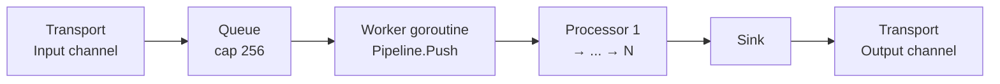

# Pipeline

Package `pipeline` provides pipeline construction and execution: a linear chain of processors that flow frames downstream (and optionally upstream), plus a runner that wires transport I/O to the pipeline.

## Purpose

- **Pipeline**: Holds processors in order; `Add`/`Link` build the chain; `Push` injects frames into the first processor; `Setup`/`Cleanup` manage lifecycle.
- **Runner**: Connects a `Transport` (input/output channels) to a `Pipeline`; starts transport and pipeline, pushes a `StartFrame`, forwards transport input through a queue into the pipeline, and sends pipeline output (from the sink) to transport. Runs until context is cancelled.
- **Source/Sink**: `Source` reads from a channel and pushes downstream; `Sink` forwards downstream frames to a channel (used as the pipeline tail for transport output).
- **Task**: `PipelineTask` runs a pipeline with a frame queue; callers queue frames (e.g. `StartFrame`, audio, `EndFrame`); `StopWhenDone` queues `EndFrame`; `Cancel` queues `CancelFrame` and cancels context.
- **Registry**: `RegisterProcessor` and `ProcessorsFromConfig` build processors by name from config (plugins).
- **ParallelPipeline**: Multiple sub-pipelines (branches) receive the same input; lifecycle frames are synchronized across branches; optional `OutputFilter` for branch output.
- **PipelineProcessor**: Wraps a `Pipeline` as a `Processor` for use inside another pipeline (e.g. a branch of `ParallelPipeline`).

## Exported symbols

| Symbol | Type | Description |
|--------|------|-------------|
| `Pipeline` | struct | Linear chain of processors; `Add`, `Link`, `Processors`, `Setup`, `Cleanup`, `Push`, `PushUpstream`, `Start`, `Cancel`, `AddFromConfig` |
| `Runner` | struct | Runs pipeline with transport; `NewRunner`, `Run`, `Done` |
| `Transport` | interface | `Input() <-chan Frame`, `Output() chan<- Frame`, `Start(ctx)`, `Close()` |
| `Source` | struct | Processor that reads from `In` channel and pushes downstream; `NewSource`, `Run` |
| `Sink` | struct | Processor that forwards downstream frames to `Out` channel; `NewSink`, `ProcessFrame` |
| `PipelineSource` | struct | Entry point; downstream → next, upstream → `OnUpstream`; `NewPipelineSource` |
| `PipelineSinkCallback` | struct | Exit point; downstream → `OnDownstream`, upstream → prev; `NewPipelineSinkCallback` |
| `DownstreamCallback` | type | `func(ctx, f Frame) error` |
| `UpstreamCallback` | type | `func(ctx, f Frame) error` |
| `Task` | interface | `Name`, `Run`, `QueueFrame`, `QueueFrames`, `StopWhenDone`, `Cancel`, `HasFinished` |
| `TaskParams` | struct | Optional params for task run (reserved) |
| `PipelineTask` | struct | Task that runs a pipeline with a queue; `NewPipelineTask`, implements `Task` |
| `ProcessorConstructor` | type | `func(name string, opts json.RawMessage) Processor` |
| `RegisterProcessor` | func | Register constructor by name |
| `ProcessorsFromConfig` | func | Build processors from `cfg.Plugins` and `cfg.PluginOptions` |
| `ParallelPipeline` | struct | Multi-branch pipeline; `NewParallelPipeline`, `SetOutputFilter`; implements `Processor` |
| `OutputFilter` | type | `func(f Frame) bool` — if false, frame not forwarded from branch |
| `PipelineProcessor` | struct | Wraps a `Pipeline` as a `Processor`; `NewPipelineProcessor` |
| `inputQueueCap` | const | Buffer size (256) between transport read and pipeline push |

## Data flow

- **Reader goroutine**: Reads from `Transport.Input()`, sends to a buffered queue (capacity `inputQueueCap`). Prevents transport read from blocking on pipeline processing.
- **Worker goroutine**: Reads from queue, calls `Pipeline.Push` for each frame. Stops on `ErrorFrame` (fatal), `CancelFrame`, or context done.
- **Sink**: Forwards downstream frames to `Transport.Output()` in a separate goroutine so the pipeline does not block on a slow transport.

## Concurrency

- **Pipeline**: Protected by `sync.Mutex` for `Add`/`Link`/`Processors` and `startFrame`; frame processing is single-threaded along the chain.
- **Runner**: Spawns two goroutines in `Run` when `Transport.Input() != nil`: one reads from transport into a queue, one drains queue into `Pipeline.Push`. Main goroutine blocks on `<-ctx.Done()`. `Done()` returns a channel closed when `Run` returns.
- **PipelineTask**: One goroutine in `Run` drains the queue into the pipeline; `QueueFrame` blocks if the drain is not reading. After `Run` returns, queue is closed and `QueueFrame` is a no-op.
- **Sink**: Each downstream frame is sent to `Out` in a new goroutine to avoid blocking the pipeline on slow transport.
- **ParallelPipeline**: Uses mutex for branch synchronization and buffering of lifecycle frames.

## Files

| File | Description |
|------|-------------|
| `pipeline.go` | `Pipeline`, `New`, `Add`, `Link`, `Processors`, `Setup`, `Cleanup`, `Push`, `PushUpstream`, `Start`, `Cancel` |
| `runner.go` | `Transport` interface, `Runner`, `NewRunner`, `Run`, `Done`, `inputQueueCap` |
| `source_sink.go` | `Source`, `Sink`, `PipelineSource`, `PipelineSinkCallback`, callbacks |
| `task.go` | `Task`, `TaskParams`, `PipelineTask`, `NewPipelineTask` |
| `registry.go` | `ProcessorConstructor`, `RegisterProcessor`, `ProcessorsFromConfig`, `Pipeline.AddFromConfig` |
| `parallel.go` | `ParallelPipeline`, `OutputFilter`, `NewParallelPipeline`, `SetOutputFilter` |
| `pipeline_processor.go` | `PipelineProcessor`, `NewPipelineProcessor` |
| `sync_parallel.go` | Internal sync for `ParallelPipeline` lifecycle frames |
| `service_switcher.go` | Service switcher (uses `ParallelPipeline` and output filter) |
| `task_observer.go` | Task observer helpers |

## See also

- [../transport/README.md](../transport/README.md) — Transport interface implementations (WebSocket, WebRTC)
- [../processors/README.md](../processors/README.md) — Processor implementations (voice, echo, filters, aggregators)
- [../frames/README.md](../frames/README.md) — Frame types
- [../../docs/ARCHITECTURE.md](../../docs/ARCHITECTURE.md) — High-level architecture
