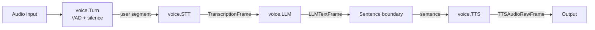
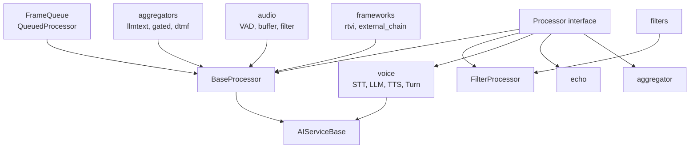

# Processors

Package `processors` provides the frame processor abstraction and built-in processors: voice pipeline (VAD/turn, STT, LLM, TTS), echo, filters, aggregators, audio, and frameworks (RTVI, external chain).

## Purpose

- **Processor**: Interface for pipeline nodes; `ProcessFrame(ctx, f, dir)` with `Direction` (Downstream/Upstream); `SetNext`/`SetPrev`, `Setup`/`Cleanup`, `Name`.
- **BaseProcessor**: Default linking and forward behavior; embed and override `ProcessFrame` (and optionally `Setup`/`Cleanup`).
- **FilterProcessor**: Forwards frames only when `FilterFunc` returns true.
- **AIServiceBase**: Base for AI stages; handles `StartFrame`/`EndFrame`/`CancelFrame` via `Start`/`Stop`/`Cancel`; `ServiceSettings` (model, voice).
- **FrameQueue** / **QueuedProcessor**: Priority queue (system frames first) and processor that drains the queue in a goroutine.
- **Subpackages**: voice (full STT→LLM→TTS pipeline), echo, filters (identity, wake, stt_mute, etc.), aggregator, aggregators (llmtext, gated, dtmf, etc.), audio (VAD, buffer, filter), frameworks (rtvi, external chain).

## Voice pipeline flow

## Processor types (root + subpackages)

## Exported symbols (root package)

| Symbol | Type | Description |
|--------|------|-------------|
| `Processor` | interface | `ProcessFrame`, `SetNext`, `SetPrev`, `Setup`, `Cleanup`, `Name` |
| `Direction` | type | `Downstream`, `Upstream` |
| `BaseProcessor` | struct | Linking; `NewBaseProcessor`, `Next`, `Prev`, `PushDownstream`, `PushUpstream`; default `ProcessFrame` forwards to next/prev |
| `FilterFunc` | type | `func(ctx, f Frame, dir Direction) bool` |
| `FilterProcessor` | struct | Forwards when filter returns true; `NewFilterProcessor` |
| `ServiceSettings` | struct | Model, Voice |
| `AIServiceBase` | struct | Embeds BaseProcessor; Start/Stop/Cancel on lifecycle frames; `NewAIServiceBase`, `Settings`, `ApplySettings` |
| `QueuedItem` | struct | Frame, Dir |
| `FrameQueue` | struct | System/data queues; `NewFrameQueue`, `Put`, `Get`, `Close` |
| `QueuedProcessor` | struct | Runs processor from queue in goroutine; `NewQueuedProcessor`, `Run` |

## Concurrency

- **BaseProcessor / FilterProcessor**: No internal goroutines; single-threaded along the pipeline chain.
- **FrameQueue**: Protected by `sync.Mutex`; `Put`/`Get` safe for concurrent use; `Get` blocks until item or closed.
- **QueuedProcessor.Run**: One goroutine drains the queue and calls `ProcessFrame`; started by caller.
- **voice**: STT/LLM/TTS may call external APIs (blocking or streaming); turn detection and interruption may use internal goroutines (see voice package).

## Files (root)

| File | Description |
|------|-------------|
| `processor.go` | Processor, Direction, BaseProcessor |
| `filter.go` | FilterFunc, FilterProcessor |
| `ai_base.go` | ServiceSettings, AIServiceBase |
| `queue.go` | QueuedItem, FrameQueue, QueuedProcessor |

## Subpackages

| Path | Description |
|------|-------------|
| [voice/](voice/) | Turn (VAD + silence), STT, LLM, TTS; full voice pipeline; register |
| [echo/](echo/) | Echo processor (for testing) |
| [filters/](filters/) | identity, null, wake_check, wake_notifier, stt_mute, function_filter; register |
| [aggregator/](aggregator/) | Base aggregator |
| [aggregators/](aggregators/) | llmtext, gated, gatedcontext, dtmf, llmfullresponse, llmcontextsummarizer, userresponse |
| [audio/](audio/) | VAD processor, audio buffer, audio filter; register |
| [logger/](logger/) | Logging processor |
| [frameworks/](frameworks/) | RTVI serialize/processor, external_chain; register |

## See also

- [../pipeline/README.md](../pipeline/README.md) — Pipeline chains processors
- [../frames/README.md](../frames/README.md) — Frame types
- [../services/README.md](../services/README.md) — STT/LLM/TTS services used by voice
- [../audio/README.md](../audio/README.md) — VAD, turn detection used by voice
