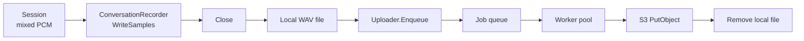

# Recording

Package `recording` provides conversation audio recording to local WAV files and async upload to S3 via a worker pool.

## Purpose

- **ConversationRecorder**: Records mixed PCM 16-bit mono samples for a single session; `WriteSamples` appends audio; `Close` finalizes the WAV file and returns `LocalFileInfo`.
- **Uploader**: Accepts `RecordingJob` (local path, bucket, key); worker pool uploads to S3 and removes the local file on success. Used when a session ends: recorder is closed, then a job is enqueued.

## Exported symbols

| Symbol | Type | Description |
|--------|------|-------------|
| `ConversationRecorder` | interface | `WriteSamples(samples []int16, sampleRate int) error`, `Close() (LocalFileInfo, error)` |
| `LocalFileInfo` | struct | `Path`, `StartedAt`, `EndedAt`, `Format` |
| `NewFileRecorder` | func | Creates a file-based recorder writing `<dir>/<base>.wav`; writes empty WAV header, finalizes on Close |
| `RecordingJob` | struct | `LocalPath`, `Bucket`, `Key` |
| `Uploader` | struct | S3 upload worker pool; `NewUploader`, `Enqueue`, `Shutdown` |
| `NewUploader` | func | Builds uploader with AWS default config; starts `workerCount` goroutines reading from job queue |
| `BuildS3Key` | func | Builds key `basePath/yyyy/mm/dd/<callID>.<format>` |

## Data flow

- Session end: caller closes the recorder (get `LocalFileInfo`), builds `RecordingJob` with path, bucket, key (e.g. via `BuildS3Key`), then `Uploader.Enqueue(job)`.
- Workers pull jobs from the channel and upload; on success the local file is removed. Metrics: `RecordingJobsEnqueuedTotal`, `RecordingJobsSuccessTotal`, `RecordingJobsFailedTotal`, `RecordingQueueDepth`.

## Concurrency

- **ConversationRecorder**: Intended for single-goroutine use (e.g. one recorder per session).
- **Uploader**: `Enqueue` is safe for concurrent use; `Shutdown` closes the job channel and waits for workers (or ctx done). Worker goroutines run until the job channel is closed.

## Files

| File | Description |
|------|-------------|
| `recorder.go` | `ConversationRecorder`, `LocalFileInfo`, `NewFileRecorder`, fileRecorder impl |
| `wav.go` | WAV header write and finalize (internal) |
| `uploader.go` | `RecordingJob`, `Uploader`, `NewUploader`, `Enqueue`, `Shutdown`, `BuildS3Key`, worker loop |

## See also

- [../metrics/README.md](../metrics/README.md) — Recording metrics
- [../config/README.md](../config/README.md) — Recording config (bucket, base_path, worker_count)
- [../../docs/ARCHITECTURE.md](../../docs/ARCHITECTURE.md) — Pipeline and session flow
