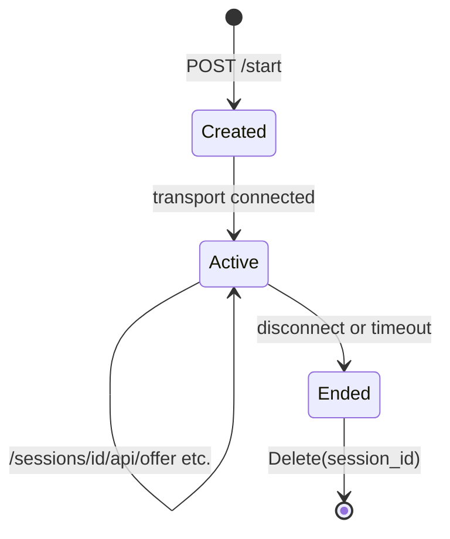

# Runner

Package `runner` provides runner types, session storage, and telephony/WebRTC session argument types for the development runner (POST /start, /sessions/{id}, Daily, LiveKit, etc.).

## Purpose

- **Session**: Per-call/session data (Body from /start, EnableDefaultIceServers).
- **SessionStore**: Put/Get/Delete sessions by ID; in-memory (single instance) or Redis (horizontal scaling).
- **Runner args**: `RunnerArgs`, `DailyRunnerArgs`, `WebSocketRunnerArgs`, `SmallWebRTCRunnerArgs`, `LiveKitRunnerArgs` carry transport-specific parameters (room URL, token, SDP, etc.).
- **Telephony**: `TelephonyCallData`, `ParseTelephonyMessage` detect provider (Twilio, Telnyx, Plivo, Exotel) and build the right frame serializer.
- **Dial-in**: `DialinSettings`, `DailyDialinRequest` for Daily PSTN dial-in webhook.

## Session lifecycle

- Server creates a session (e.g. on POST /start), stores it in `SessionStore`, returns session ID. Client uses the ID for WebRTC offer or WebSocket telephony. When the call ends, the server deletes the session.

## Exported symbols

| Symbol | Type | Description |
|--------|------|-------------|
| `Session` | struct | Body, EnableDefaultIceServers |
| `SessionStore` | interface | Put(id, sess), Get(id), Delete(id) |
| `MemorySessionStore` | struct | In-memory store; `NewMemorySessionStore`, Put, Get, Delete |
| `RedisSessionStore` | struct | Redis-backed store with TTL; `RedisSessionStoreOptions`, `NewRedisSessionStore` |
| `NewSessionStoreFromConfig(cfg)` | func | Returns memory or Redis store from config (session_store, redis_url, session_ttl_secs) |
| `RunnerArgs` | struct | HandleSigint, HandleSigterm, PipelineIdleTimeoutSecs, Body |
| `DailyRunnerArgs` | struct | RunnerArgs + RoomURL, Token |
| `WebSocketRunnerArgs` | struct | RunnerArgs + Body (telephony) |
| `SmallWebRTCRunnerArgs` | struct | RunnerArgs + SDP, Type, PCID, RestartPC, RequestData |
| `LiveKitRunnerArgs` | struct | RunnerArgs + RoomName, URL, Token |
| `DialinSettings` | struct | CallID, CallDomain, To, From, SIPHeaders (Daily dial-in) |
| `DailyDialinRequest` | struct | DialinSettings, DailyAPIKey, DailyAPIURL |
| `TelephonyCallData` | struct | Provider, stream/call IDs, body (Twilio, Telnyx, Plivo, Exotel) |
| `ParseTelephonyMessage(first, second []byte)` | func | Detects provider and returns TelephonyCallData |
| Serializer helpers | funcs | Build Twilio/Telnyx/Plivo/Exotel serializer from TelephonyCallData |

## Concurrency

- **MemorySessionStore**: Protected by `sync.RWMutex` for Put/Get/Delete.
- **RedisSessionStore**: Uses Redis client (safe for concurrent use); Put sets TTL.

## Files

| File | Description |
|------|-------------|
| `types.go` | RunnerArgs, DailyRunnerArgs, WebSocketRunnerArgs, SmallWebRTCRunnerArgs, LiveKitRunnerArgs, DialinSettings, DailyDialinRequest |
| `session.go` | Session, SessionStore, MemorySessionStore |
| `session_factory.go` | NewSessionStoreFromConfig |
| `redis_session.go` | RedisSessionStore, RedisSessionStoreOptions, NewRedisSessionStore |
| `telephony.go` | TelephonyCallData, ParseTelephonyMessage, serializer construction |

## Subpackages

| Path | Description |
|------|-------------|
| [daily/](daily/) | Daily.co transport integration (room, token, dial-in) |
| [livekit/](livekit/) | LiveKit transport integration |

## See also

- [../config/README.md](../config/README.md) — session_store, redis_url, runner_transport
- [../transport/README.md](../transport/README.md) — WebSocket, WebRTC transports
- [../frames/README.md](../frames/README.md) — Frame serializers (Twilio, Telnyx, etc.)
- [../../docs/SYSTEM_ARCHITECTURE.md](../../docs/SYSTEM_ARCHITECTURE.md) — Runner and entry points
