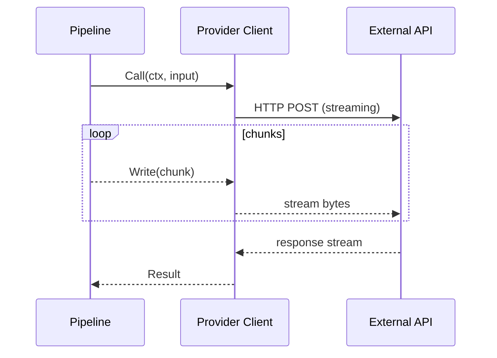
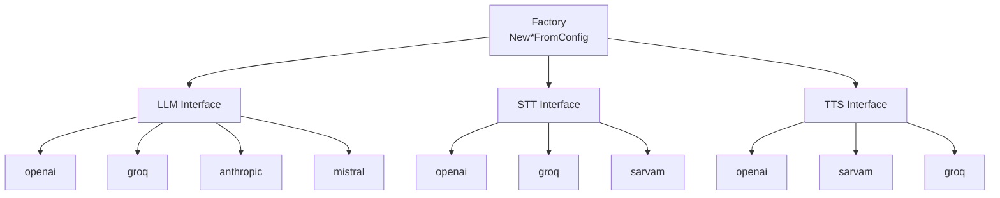

# Services layer

This package provides LLM, STT, TTS, and realtime service abstractions aligned with common LLM/STT/TTS service patterns. Use the factory and `config.Config` to construct implementations by provider name.

## API interaction (streaming)



## Provider registry



## Interfaces

- **LLMService** — chat completion with optional streaming (`Chat(ctx, messages, onToken)`).
- **STTService** — transcription (`Transcribe(ctx, audio, sampleRate, numChannels)`). Optional **STTStreamingService** adds `TranscribeStream`.
- **TTSService** — text-to-speech (`Speak(ctx, text, sampleRate)`). Optional **TTSStreamingService** adds `SpeakStream`.
- **RealtimeService** — creates **RealtimeSession** (SendText, SendAudio, Events, Close). Use `realtime.NewFromConfig(cfg, provider)` to construct (lives in `pkg/realtime` to avoid import cycles).

## Supported providers (Go implementation)

These are the providers currently implemented in this Go port.

| Provider    | LLM | STT | TTS | Realtime |
|------------|-----|-----|-----|----------|
| openai     | ✓   | ✓   | ✓   | ✓        |
| groq       | ✓   | ✓   | ✓   | —        |
| sarvam     | —   | ✓   | ✓   | —        |
| grok       | ✓   | —   | —   | —        |
| cerebras   | ✓   | —   | —   | —        |
| elevenlabs | —   | ✓   | ✓   | —        |
| aws        | ✓   | ✓   | ✓   | —        |
| mistral    | ✓   | —   | —   | —        |
| deepseek   | ✓   | —   | —   | —        |
| ollama     | ✓   | —   | —   | —        |
| qwen       | ✓   | —   | —   | —        |
| whisper    | —   | ✓   | —   | —        |
| asyncai    | ✓   | —   | —   | —        |
| camb       | —   | ✓   | —   | —        |
| fish       | ✓   | —   | —   | —        |
| gradium    | —   | ✓   | —   | —        |
| hume       | —   | —   | ✓   | ✓ (stub) |
| inworld    | ✓   | —   | ✓   | ✓ (stub) |
| minimax    | ✓   | —   | ✓   | —        |
| moondream  | ✓   | —   | —   | —        |
| neuphonic   | —   | —   | ✓   | —        |
| openpipe   | ✓   | —   | —   | —        |
| soniox     | —   | ✓   | —   | —        |
| xtts       | —   | —   | ✓   | —        |

Constants: `ProviderOpenAI`, `ProviderGroq`, `ProviderSarvam`, `ProviderGrok`, `ProviderCerebras`, `ProviderElevenLabs`, `ProviderAWS`, `ProviderMistral`, `ProviderDeepSeek`, `ProviderOllama`, `ProviderQwen`, `ProviderWhisper`, `ProviderAsyncAI`, `ProviderCamb`, `ProviderFish`, `ProviderGradium`, `ProviderHume`, `ProviderInworld`, `ProviderMinimax`, `ProviderMoondream`, `ProviderNeuphonic`, `ProviderOpenPipe`, `ProviderSoniox`, `ProviderXTTS`. Realtime: `SupportedRealtimeProviders` (`"openai"`, `"hume"`, `"inworld"`).

## Upstream providers and Go coverage

The upstream Python services expose many more providers.
The table below inventories those providers by capability and indicates whether they
currently have a Go implementation in this repository.

Legend:

- **✓** — capability provided by the upstream Python services.
- **—** — capability not provided (or not primary) for that provider.
- **Go** — whether this capability is implemented in the Go services layer.

| Provider             | Upstream LLM | Upstream STT | Upstream TTS | Upstream Realtime | Go LLM | Go STT | Go TTS | Go Realtime |
|----------------------|--------------|--------------|--------------|-------------------|--------|--------|--------|-------------|
| anthropic            | ✓            | —            | —            | —                 | —      | —      | —      | —           |
| assemblyai           | —            | ✓            | —            | —                 | —      | —      | —      | —           |
| asyncai              | ✓            | —            | —            | —                 | ✓      | —      | —      | —           |
| aws                  | ✓            | ✓            | ✓            | —                 | ✓      | ✓      | ✓      | —           |
| aws_nova_sonic       | ✓            | —            | ✓            | —                 | —      | —      | —      | —           |
| azure                | ✓            | ✓            | ✓            | —                 | —      | —      | —      | —           |
| camb                 | —            | ✓            | —            | —                 | —      | ✓      | —      | —           |
| cartesia             | —            | —            | ✓            | —                 | —      | —      | —      | —           |
| cerebras             | ✓            | —            | —            | —                 | ✓      | —      | —      | —           |
| deepgram             | —            | ✓            | —            | —                 | —      | —      | —      | —           |
| deepseek             | ✓            | —            | —            | —                 | ✓      | —      | —      | —           |
| elevenlabs           | —            | ✓            | ✓            | —                 | —      | ✓      | ✓      | —           |
| fal                  | ✓            | —            | —            | —                 | —      | —      | —      | —           |
| fireworks            | ✓            | —            | —            | —                 | —      | —      | —      | —           |
| fish                 | ✓            | —            | —            | —                 | —      | —      | —      | —           |
| gemini_multimodal_live | ✓          | ✓            | ✓            | ✓                 | —      | —      | —      | —           |
| gladia               | —            | ✓            | —            | —                 | —      | —      | —      | —           |
| google               | ✓            | ✓            | ✓            | ✓                 | —      | —      | —      | —           |
| gradium              | —            | ✓            | —            | —                 | —      | —      | —      | —           |
| grok                 | ✓            | —            | —            | —                 | ✓      | —      | —      | —           |
| groq                 | ✓            | ✓            | ✓            | —                 | ✓      | ✓      | ✓      | —           |
| hathora              | —            | —            | —            | ✓                 | —      | —      | —      | —           |
| heygen               | —            | —            | ✓            | ✓                 | —      | —      | —      | —           |
| hume                 | —            | —            | ✓            | ✓                 | —      | —      | ✓      | ✓ (stub)    |
| inworld              | ✓            | —            | ✓            | ✓                 | ✓      | —      | ✓      | ✓ (stub)    |
| kokoro               | —            | —            | ✓            | —                 | —      | —      | —      | —           |
| lmnt                 | —            | —            | ✓            | —                 | —      | —      | —      | —           |
| mem0                 | —            | —            | —            | —                 | —      | —      | —      | —           |
| minimax              | ✓            | —            | ✓            | —                 | ✓      | —      | ✓      | —           |
| mistral              | ✓            | —            | —            | —                 | ✓      | —      | —      | —           |
| moondream            | ✓            | —            | —            | —                 | ✓      | —      | —      | —           |
| neuphonic            | —            | —            | ✓            | —                 | —      | —      | ✓      | —           |
| nim                  | ✓            | —            | —            | —                 | —      | —      | —      | —           |
| nvidia               | ✓            | ✓            | ✓            | —                 | —      | —      | —      | —           |
| ollama               | ✓            | —            | —            | —                 | ✓      | —      | —      | —           |
| openai               | ✓            | ✓            | ✓            | ✓                 | ✓      | ✓      | ✓      | ✓           |
| openai_realtime      | ✓            | ✓            | ✓            | ✓                 | —      | —      | —      | —           |
| openai_realtime_beta | ✓            | ✓            | ✓            | ✓                 | —      | —      | —      | —           |
| openpipe             | ✓            | —            | —            | —                 | ✓      | —      | —      | —           |
| openrouter           | ✓            | —            | —            | —                 | —      | —      | —      | —           |
| perplexity           | ✓            | —            | —            | —                 | —      | —      | —      | —           |
| piper                | —            | —            | ✓            | —                 | —      | —      | —      | —           |
| qwen                 | ✓            | —            | —            | —                 | ✓      | —      | —      | —           |
| resembleai           | —            | —            | ✓            | —                 | —      | —      | —      | —           |
| rime                 | —            | ✓            | —            | —                 | —      | —      | —      | —           |
| riva                 | —            | ✓            | ✓            | —                 | —      | —      | —      | —           |
| sambanova            | ✓            | —            | —            | —                 | —      | —      | —      | —           |
| sarvam               | —            | ✓            | ✓            | —                 | —      | ✓      | ✓      | —           |
| simli                | —            | —            | ✓            | ✓                 | —      | —      | —      | —           |
| soniox               | —            | ✓            | —            | —                 | —      | ✓      | —      | —           |
| speechmatics         | —            | ✓            | —            | —                 | —      | —      | —      | —           |
| tavus                | —            | —            | ✓            | ✓                 | —      | —      | —      | —           |
| together             | ✓            | —            | —            | —                 | —      | —      | —      | —           |
| ultravox             | —            | —            | ✓            | —                 | —      | —      | —      | —           |
| whisper              | —            | ✓            | —            | —                 | —      | ✓      | —      | —           |
| xtts                 | —            | —            | ✓            | —                 | —      | —      | ✓      | —           |


## Configuration

Use **config.Config** (JSON or env):

- **provider** — default for all tasks.
- **stt_provider**, **llm_provider**, **tts_provider** — override per task.
- **model** — chat/LLM model (e.g. `gpt-3.5-turbo`, `mistral-small-latest`, `deepseek-chat`).
- **stt_model**, **tts_model**, **tts_voice** — task-specific when supported.
- **api_keys** — map of service name to API key; otherwise keys are read from environment.

### Environment variables (fallback when not in `api_keys`)

| Provider   | Env var |
|-----------|---------|
| openai    | OPENAI_API_KEY |
| groq      | GROQ_API_KEY |
| sarvam    | SARVAM_API_KEY |
| grok (xai) | XAI_API_KEY |
| cerebras  | CEREBRAS_API_KEY |
| elevenlabs| ELEVENLABS_API_KEY |
| aws       | AWS_SECRET_ACCESS_KEY, AWS_REGION (optional, default us-east-1) |
| mistral   | MISTRAL_API_KEY |
| deepseek  | DEEPSEEK_API_KEY |
| ollama    | OLLAMA_API_KEY (optional), OLLAMA_BASE_URL (optional, default http://localhost:11434/v1) |
| qwen      | DASHSCOPE_API_KEY or QWEN_API_KEY, DASHSCOPE_BASE_URL (optional) |
| whisper   | WHISPER_API_KEY or OPENAI_API_KEY, WHISPER_BASE_URL (optional) |
| asyncai   | ASYNC_AI_API_KEY, ASYNC_AI_BASE_URL (optional) |
| camb      | CAMB_API_KEY, CAMB_BASE_URL (optional) |
| fish      | FISH_API_KEY, FISH_BASE_URL (optional) |
| gradium   | GRADIUM_API_KEY, GRADIUM_BASE_URL (optional) |
| hume      | HUME_API_KEY |
| inworld   | INWORLD_API_KEY |
| minimax   | MINIMAX_API_KEY, MINIMAX_BASE_URL (optional) |
| moondream | MOONDREAM_API_KEY, MOONDREAM_BASE_URL (optional) |
| neuphonic  | NEUPHONIC_API_KEY, NEUPHONIC_BASE_URL (optional) |
| openpipe  | OPENPIPE_API_KEY |
| soniox    | SONIOX_API_KEY, SONIOX_WS_URL (optional), SONIOX_MODEL (optional) |
| xtts      | XTTS_BASE_URL (optional, default http://localhost:8000 for local server) |

## Usage

```go
cfg, _ := config.LoadConfig("config.json")
// Or build manually:
cfg := &config.Config{
    LlmProvider: services.ProviderMistral,
    Model:       "mistral-small-latest",
}

llm := services.NewLLMFromConfig(cfg, cfg.LLMProvider(), cfg.Model)
stt := services.NewSTTFromConfig(cfg, cfg.STTProvider())
tts := services.NewTTSFromConfig(cfg, cfg.TTSProvider(), cfg.TTSModel, cfg.TTSVoice)

// Realtime (e.g. OpenAI Realtime WebSocket API):
realtimeSvc, err := realtime.NewFromConfig(cfg, "openai")
```

One-shot construction for all three:

```go
llm, stt, tts := services.NewServicesFromConfig(cfg)
```

## Tests

- `tests/pkg/services/` — factory construction tests for all supported providers; Sarvam integration test (requires `SARVAM_API_KEY`).
- `tests/pkg/realtime/` — realtime.NewFromConfig for openai and unsupported provider.

## See also

- [../config/README.md](../config/README.md) — Config and API key resolution
- [../processors/README.md](../processors/README.md) — Voice pipeline uses STT/LLM/TTS services
- [../frames/README.md](../frames/README.md) — TranscriptionFrame, LLMTextFrame, TTSAudioRawFrame
- [../../docs/ARCHITECTURE.md](../../docs/ARCHITECTURE.md) — High-level architecture
