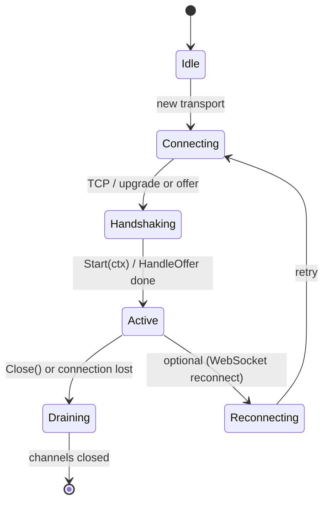

# Transport

Package `transport` defines the transport interface for pipeline input/output and provides implementations: WebSocket, SmallWebRTC, and in-memory (for tests).

## Purpose

A **Transport** supplies frames from the client to the pipeline (Input channel) and receives frames from the pipeline to send to the client (Output channel). The pipeline runner calls `Start(ctx)` to establish the connection, then reads from `Input()` and writes to `Output()` until context is cancelled or the transport is closed.

## Exported symbols (root package)

| Symbol | Type | Description |
|--------|------|-------------|
| `Transport` | interface | `Input() <-chan Frame`, `Output() chan<- Frame`, `Start(ctx) error`, `Close() error` |
| `Base` | struct | Optional base for implementations; `Name`, `Log` (Logger); `SetName`, `GetName`, `Logf` |
| `Logger` | interface | `Printf(format string, v ...interface{})` |

## Implementations

| Subpackage | Type | Description |
|------------|------|-------------|
| `websocket` | `ConnTransport` | WebSocket connection; frames serialized (JSON or custom) over the wire; read/write goroutines; `Upgrade`, `NewConnTransport`, `Input`, `Output`, `Start`, `Close`, `Done`, `LastActivity` |
| `smallwebrtc` | `Transport` | WebRTC peer connection; inbound RTP/Opus → PCM to Input; TTS PCM → Opus to Output; `Config`, `NewTransport`, `HandleOffer`, `Start`, `Close`, `Input`, `Output`; CGO for Opus encoder |
| `memory` | `Transport` | In-memory channels for tests; `NewTransport`, `NewTransportWithBuffer`, `SendInput`, `Out`; no network |

## Connection lifecycle

- **WebSocket**: Server upgrades HTTP → WebSocket; `ConnTransport` starts read/write goroutines; `Start` returns when ready; `Close` closes channels and connection.
- **SmallWebRTC**: Client sends SDP offer; server calls `HandleOffer` → SDP answer; `Start` starts inbound/outbound processing; `Close` closes peer connection and channels.
- **Memory**: `Start` returns immediately; `Close` closes input channel (output left open to avoid panic from in-flight sends).

## Concurrency

- **Transport interface**: Implementations must allow concurrent reads from `Input()` and writes to `Output()` from different goroutines; `Close` is typically idempotent and must not be called concurrently with sends after close.
- **websocket.ConnTransport**: Read loop goroutine (client → inCh); write loop goroutine (outCh → client); `Close` closes channels and connection; `Done()` signals shutdown.
- **smallwebrtc.Transport**: Inbound RTP processed in peer connection callback → inCh; outbound from outCh encoded and sent on track; `Close` via sync.Once.
- **memory.Transport**: Caller goroutines use `SendInput`; runner reads Input and writes Output; `Close` closes inCh and closed channel.

## Files (root)

| File | Description |
|------|-------------|
| `transport.go` | `Transport` interface |
| `base.go` | `Base`, `Logger` |

## Subpackages

| Path | Description |
|------|-------------|
| [websocket/](websocket/) | WebSocket transport; reconnect helpers in `reconnect.go` |
| [smallwebrtc/](smallwebrtc/) | WebRTC transport; Opus inbound/outbound (CGO and nocgo) |
| [memory/](memory/) | In-memory transport for tests |
| [whatsapp/](whatsapp/) | WhatsApp-specific transport and API |

## See also

- [../pipeline/README.md](../pipeline/README.md) — Runner uses Transport to feed pipeline
- [../frames/README.md](../frames/README.md) — Frame types sent/received
- [../../docs/CONNECTIVITY.md](../../docs/CONNECTIVITY.md) — Wire formats and deployment
