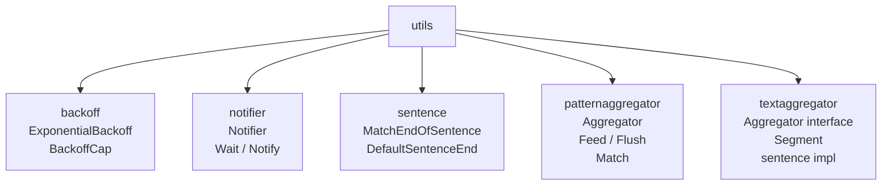

# Utils

Package `utils` provides shared utilities: backoff, notifier, sentence-boundary detection, and text/pattern aggregation for LLM streams.

## Purpose

- **backoff**: Exponential backoff for retries/reconnection (e.g. WebSocket).
- **notifier**: One-shot signal: one goroutine waits, another notifies (Wait/Notify).
- **sentence**: Sentence-end detection (e.g. `.!?`) for aggregating text.
- **patternaggregator**: Delimiter-based aggregation (e.g. `` ` `` … `` ` ``) to extract tagged content from LLM output (IVR, DTMF).
- **textaggregator**: Interface and implementations to aggregate incremental text (e.g. LLM tokens) into segments (e.g. sentences).

## Utility tree

## Exported symbols (root)

| Symbol | Type | Description |
|--------|------|-------------|
| `BackoffCap` | const | Max duration (60s) for ExponentialBackoff |
| `ExponentialBackoff(attempt)` | func | Returns 2^attempt seconds, capped at BackoffCap; attempt 1-based |

## Subpackages

| Path | Exported symbols | Description |
|------|------------------|-------------|
| `notifier` | `Notifier`, `New`, `Notify`, `Wait` | One waiter unblocked per Notify; safe for concurrent use |
| `sentence` | `DefaultSentenceEnd`, `MatchEndOfSentence(s, endChars)` | Reports if trimmed s ends with sentence-ending rune |
| `patternaggregator` | `Match`, `Aggregator`, `New(open, close)`, `Feed`, `Flush` | Emits text segments and delimiter matches from stream |
| `textaggregator` | `Segment`, `Aggregator` (interface: Aggregate, Flush, Reset, HandleInterruption) | Aggregate incremental text into segments; sentence implementation |

## Concurrency

- **backoff**: Stateless; safe for concurrent use.
- **notifier**: `Notify` and `Wait` are safe for concurrent use; mutex protects the channel.
- **sentence**: Stateless; safe for concurrent use.
- **patternaggregator**: Aggregator is not safe for concurrent use; one caller should Feed/Flush.
- **textaggregator**: Implementations are typically single-threaded per aggregator instance.

## Files

| File | Description |
|------|-------------|
| `backoff.go` | BackoffCap, ExponentialBackoff |
| `notifier/notifier.go` | Notifier, New, Notify, Wait |
| `sentence/sentence.go` | DefaultSentenceEnd, MatchEndOfSentence |
| `patternaggregator/patternaggregator.go` | Match, Aggregator, New, Feed, Flush |
| `textaggregator/textaggregator.go` | Segment, Aggregator interface |
| `textaggregator/sentence.go` | Sentence-based aggregator implementation |

## See also

- [../transport/README.md](../transport/README.md) — Reconnect backoff (WebSocket)
- [../processors/README.md](../processors/README.md) — Voice pipeline uses sentence/text aggregation
- [../../docs/EXTENSIONS.md](../../docs/EXTENSIONS.md) — IVR uses patternaggregator for DTMF
